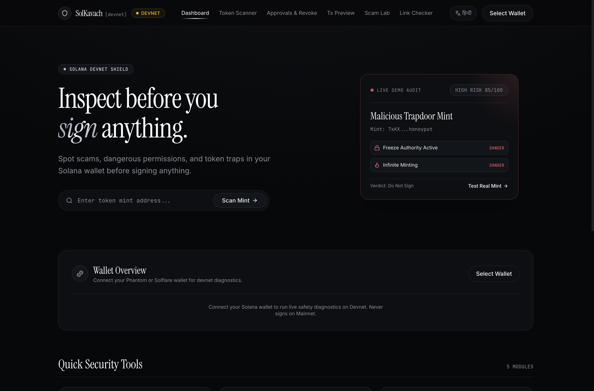
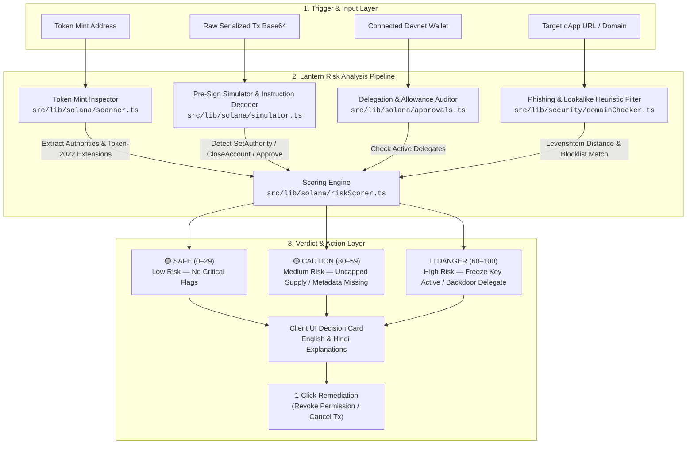
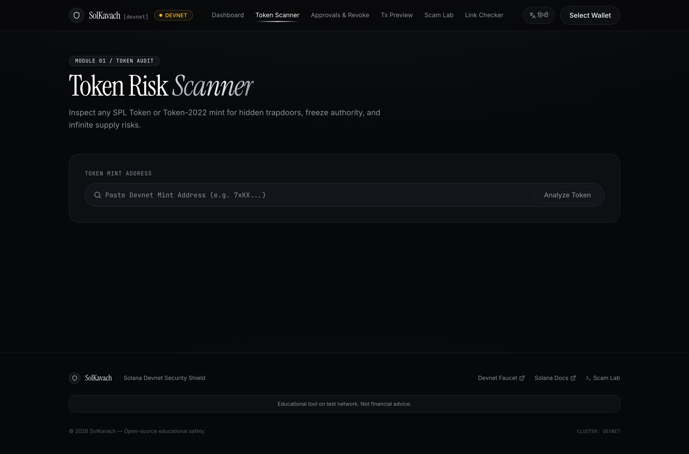
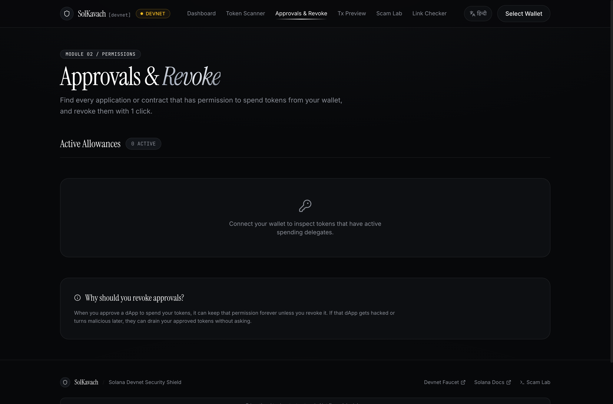
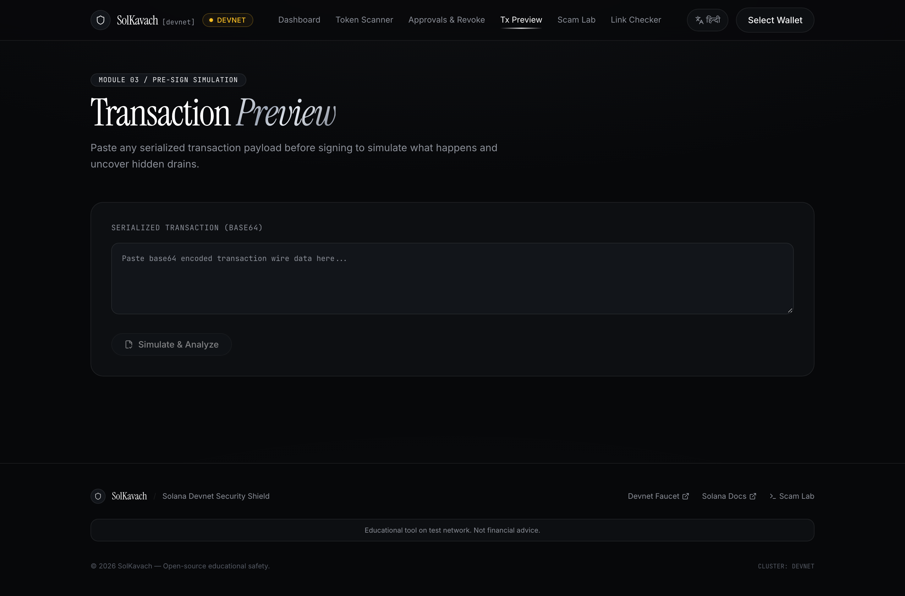
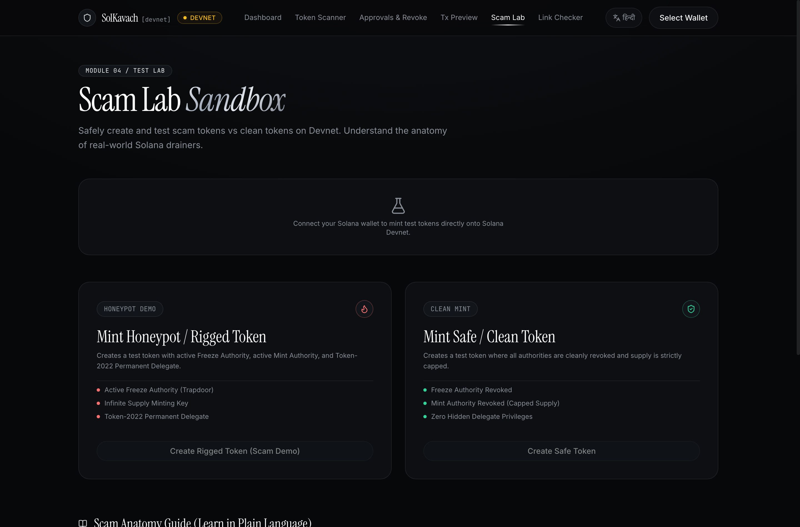
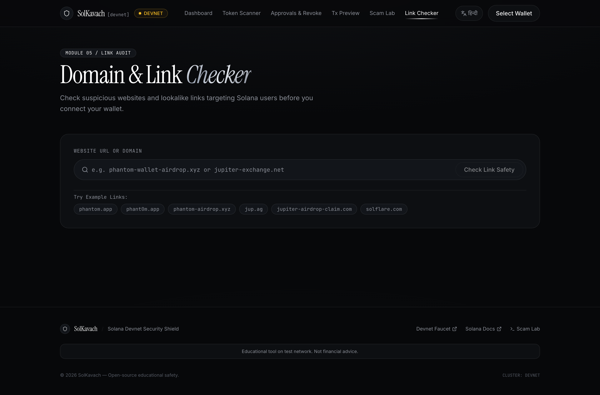

<div align="center">

# 🏮 Lantern (लालटेन)

**Pre-Sign Solana Security & Scam Detection Engine**

[](https://solana.com)
[-black?style=flat-square&logo=next.js)](https://nextjs.org)
[](https://www.typescriptlang.org)
[](https://vitest.dev)
[](#)
[](LICENSE)

<p align="center">
  A client-side security platform that illuminates risks before you sign: audits token contracts, simulates raw transactions before wallet signing, scans token account delegations, flags lookalike phishing domains, and provides a sandbox for minting and inspecting test honeypots.
</p>

---



</div>

---

## Architecture Flowchart

The following flowchart outlines the Lantern pre-sign analysis pipeline, showing how user inputs and wallet requests are routed through parallel detection modules before a composite security score and recommendation are returned:



---

## Core Security Modules

### 1. Token Risk Scanner
Inspects SPL and Token-2022 mint accounts on Solana Devnet to evaluate active mint/freeze authorities, permanent delegate privileges, transfer hook programs, and holder concentration.



---

### 2. Approvals & Revoke Manager
Discovers all token accounts in the connected wallet with active delegate spending approvals and builds single-click `createRevokeInstruction` transactions signed directly in the user's wallet.



---

### 3. Pre-Sign Transaction Preview
Decodes serialized wire transactions and runs simulated execution (`simulateTransaction`) to identify high-risk instructions (`SetAuthority`, `Approve`, `CloseAccount`) and balance diffs before signing.



---

### 4. Scam Lab Sandbox
An educational playground for minting both intentionally rigged honeypots (with active freeze authority and permanent delegate backdoors) and safe tokens to verify how scanner heuristics function in practice.



---

### 5. Domain & Phishing Checker
Analyzes input URLs against a known drainer blocklist and executes character-level typo-squatting heuristics to detect lookalike attacks targeting official Solana platforms.



---

## Technical Highlights & Browser Techniques

- **Dynamic Programming for Phishing Detection**: Uses a dynamic programming implementation of the [Levenshtein distance algorithm](https://developer.mozilla.org/en-US/docs/Web/JavaScript) in [src/lib/security/domainChecker.ts](src/lib/security/domainChecker.ts) to calculate character edit distances against verified Solana dApps.
- **URL Normalization**: Employs the native [URL API](https://developer.mozilla.org/en-US/docs/Web/API/URL) to normalize protocol schemes, strip query parameters and paths, and isolate hostnames before running heuristic checks.
- **Large Integer Handling**: Handles raw on-chain token supplies and balance units using [BigInt](https://developer.mozilla.org/en-US/docs/Web/JavaScript/Reference/Global_Objects/BigInt) to prevent floating-point precision loss on high-decimal accounts.
- **State Synchronization**: Uses the [Web Storage API (localStorage)](https://developer.mozilla.org/en-US/docs/Web/API/Web_Storage_API) within a React Context provider in [src/i18n/LanguageContext.tsx](src/i18n/LanguageContext.tsx) for synchronous language persistence across page reloads.
- **Hardware-Accelerated Styling**: Leverages [CSS backdrop-filter](https://developer.mozilla.org/en-US/docs/Web/CSS/backdrop-filter) and [CSS Custom Properties](https://developer.mozilla.org/en-US/docs/Web/CSS/CSS_cascading_variables/Using_CSS_custom_properties) in [src/app/globals.css](src/app/globals.css) for metallic accents, frosted navigation, and glassmorphic cards.
- **Accessibility & Motion Preferences**: Implements [@media (prefers-reduced-motion)](https://developer.mozilla.org/en-US/docs/Web/CSS/@media/prefers-reduced-motion) to disable transition overhead for users requesting reduced motion.

---

## Notable Technologies & Libraries

- **[@solana/spl-token](https://github.com/solana-labs/solana-program-library)**: Program client for reading SPL and Token-2022 extensions, including Permanent Delegate, Transfer Hook, and Freeze Authority configurations.
- **[@solana/wallet-adapter-react](https://github.com/anza-xyz/wallet-adapter)**: Unified wallet context provider managing browser wallet adapter states and transaction signing flows.
- **[@solana/web3.js](https://solana-labs.github.io/solana-web3.js/)**: Core Solana SDK used for RPC transport, transaction deserialization, and pre-flight simulation (`simulateTransaction`).
- **[bs58](https://github.com/cryptocoinjs/bs58)**: Fast Base58 encoder and decoder for processing raw public keys, signatures, and transaction buffers.
- **[canvas-confetti](https://www.kirilv.com/canvas-confetti/)**: Canvas-based particle animation library triggered upon successful safe actions.
- **[Lucide React](https://lucide.dev/)**: Component icon set used across module workflows.
- **[Vitest](https://vitest.dev/)**: Native ESM test runner used for executing the automated unit test suite in [src/tests/](src/tests/).

### Typography & Fonts
- **[Instrument Serif](https://fonts.google.com/specimen/Instrument+Serif)**: Primary serif display typeface.
- **[Inter](https://fonts.google.com/specimen/Inter)**: Primary body and interface typeface.
- **[JetBrains Mono](https://fonts.google.com/specimen/JetBrains+Mono)**: Monospace font for blockchain addresses, hashes, and payload streams.
- **[Noto Serif Devanagari](https://fonts.google.com/specimen/Noto+Serif+Devanagari)** & **[Noto Sans Devanagari](https://fonts.google.com/specimen/Noto+Sans+Devanagari)**: Typographic pairing for Hindi localization.

---

## Project Structure

```text
lantern/
├── docs/
│   └── assets/
├── public/
├── src/
│   ├── app/
│   │   ├── approvals/
│   │   ├── domain-check/
│   │   ├── preview/
│   │   ├── scam-lab/
│   │   └── scanner/
│   ├── components/
│   │   ├── layout/
│   │   └── wallet/
│   ├── i18n/
│   ├── lib/
│   │   ├── security/
│   │   └── solana/
│   └── tests/
├── .env.example
├── .gitignore
├── next.config.ts
├── package.json
├── README.md
└── tsconfig.json
```

### Directory Overview
- `docs/assets/`: Embedded screenshot assets and media references used for documentation.
- `src/app/`: Next.js App Router route handlers for the main dashboard and the five core security modules ([approvals](src/app/approvals/), [domain-check](src/app/domain-check/), [preview](src/app/preview/), [scam-lab](src/app/scam-lab/), [scanner](src/app/scanner/)).
- `src/components/layout/`: Common UI components including the navigation bar, footer, persistent Devnet badge, and network guard modal.
- `src/components/wallet/`: Wallet connection providers and Devnet airdrop integration components.
- `src/i18n/`: English (`en.json`) and Hindi (`hi.json`) localization dictionaries and the context provider.
- `src/lib/solana/`: Solana interaction layer for on-chain mint inspection, transaction simulation, wallet token discovery, and sandbox minting.
- `src/lib/security/`: Phishing heuristics, domain normalization, and typo-squatting detection logic.
- `src/tests/`: Automated unit tests covering scoring algorithms and domain classification.
